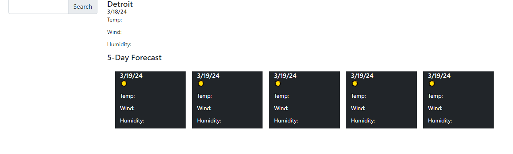

# Weather Dashboard

## Weather Dashboard
 This website allows trip planners to check weather forecasts in multiple locations at once. It uses Javascript to call openweather api for the weather data it prints, and uses jquery for DOM traversal and dayJS for date/time representations.

 ## Installation
This application runs in your browser and does not require installation.

Here is a screenshot and a link to the running website
[Weather Dashboard](https://danpatoneil.github.io/Weather-Dashboard/)

 ## Use
This project allows users to quickly and concisely call upon weather info from several locations and represent the current weather and 5 day forecast for those places in a highly readable way and easily tab between their other recent searches.

 ## Future iterations
In future, I would like the project to include functionality to save your five most recent searches to local storage and automatically load them. Once I understand geolocation better, this project could also pull the user's current location and run weather reports on that as well.

MIT License

Copyright (c) 2024 Daniel O'Neil

Permission is hereby granted, free of charge, to any person obtaining a copy
of this software and associated documentation files (the "Software"), to deal
in the Software without restriction, including without limitation the rights
to use, copy, modify, merge, publish, distribute, sublicense, and/or sell
copies of the Software, and to permit persons to whom the Software is
furnished to do so, subject to the following conditions:

The above copyright notice and this permission notice shall be included in all
copies or substantial portions of the Software.

THE SOFTWARE IS PROVIDED "AS IS", WITHOUT WARRANTY OF ANY KIND, EXPRESS OR
IMPLIED, INCLUDING BUT NOT LIMITED TO THE WARRANTIES OF MERCHANTABILITY,
FITNESS FOR A PARTICULAR PURPOSE AND NONINFRINGEMENT. IN NO EVENT SHALL THE
AUTHORS OR COPYRIGHT HOLDERS BE LIABLE FOR ANY CLAIM, DAMAGES OR OTHER
LIABILITY, WHETHER IN AN ACTION OF CONTRACT, TORT OR OTHERWISE, ARISING FROM,
OUT OF OR IN CONNECTION WITH THE SOFTWARE OR THE USE OR OTHER DEALINGS IN THE
SOFTWARE.
